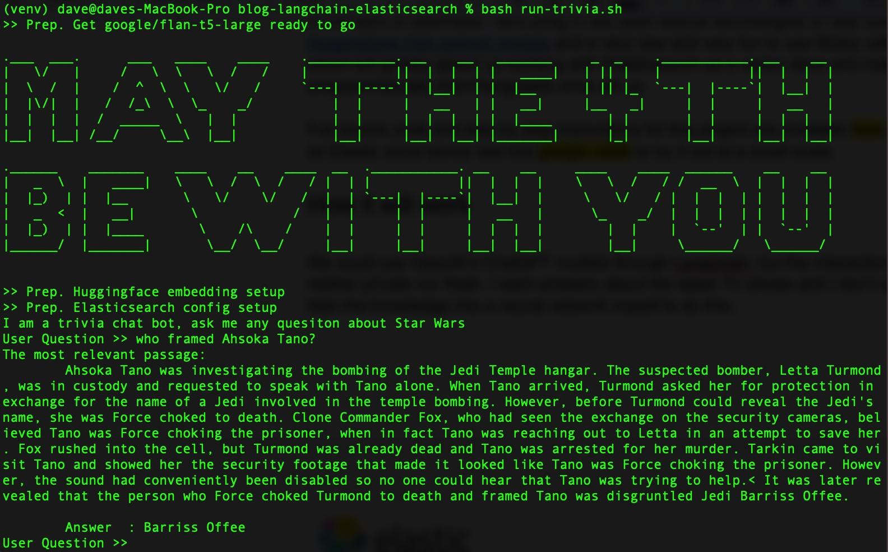

# blog-langchain-elasticsearch
*Experiment using elastic vector search and langchain*

To run at small scale, check out this google colab [](https://colab.research.google.com/github/derickson/blog-langchain-elasticsearch/blob/main/Notebooks/Privacy_first_AI_search_using_LangChain_and_Elasticsearch.ipynb)

Those who remember the early days of Elasticsearch will remember that ES nodes were spawned with random superhero names that may or may not have come from a wiki scrape of super heros from a certain marvellous comic book universe. Personally, I was always more of a Star Wars fan. In celebration of May the 4th, and amid all the excitement of the rapidly evolving world of AI and Large Language Models, here's an experiment using Star Wars data to create a trivia bot that can answer Star Wars questions.

The general design:
1. Scrape data from Wookieepedia
2. Insert that data into Elasticsearch along with a vector embedding for semantic search
3. create a simple chat loop with a local LLM.
4. Given a user's question, get the #1 most relevant paragraph from wookiepedia based on vector similarity
5. get the LLM to answer the question using some 'prompt engineering' shoving the paragraph into a context section of the call to the LLM.




# Setup
```sh
python3 -m venv venv
source venv/bin/activate
pip install --upgrade pip
pip install -r requirements.txt
```

Or to directly install the libraries we'll need:
```sh
pip install beautifulsoup4 eland elasticsearch huggingface-hub langchain tqdm torch requests sentence_transformers
```

Now create a .env file in the root of this project with the following conent to protect your keys and passwords. You can create a free account at HuggingFace. Elastic Cloud is a great place to spin up a cluster for a short experiment, especially since in step 3 I'll be throwing some horsepower behind creating vector embeddings.
```sh
export ES_SERVER="YOURDESSERVERNAME.es.us-central1.gcp.cloud.es.io"
export ES_USERNAME="YOUR READ WRITE AND INDEX CREATING USER"
export ES_PASSWORD="YOUR PASSWORD"
```

# Step 1 - Pulling data from Wookiepedia
You can skip this step as I've left a smaller sample with all the paragrpahs from a few key fresh star wars aritcles (Mandalorian Spoliers ahead) in starwars_small_canon_data.pickle

Note ... unless you want the absolute freshest of Star Wars content, the first paragraphs of all of canon articles from Wookieepedia can be found in the inspriation for this blog post here: https://github.com/dennisbakhuis/wookieepediascience.  

Let's go easy on Wookieepedia's hosting company and not have every vector curious star wars fan scraping the data on the same day. If you do want to do a fresh scrape. The following code should first load up a list of the page URLs we want and 2nd a series of .pickle files containing the full page contents of each of those URLs. See Dennis Bakhuis' excellent blog for more on this code https://towardsdatascience.com/star-wars-data-science-d32acde3432d

```sh
bash run-full-scrape.sh
```

Expect to be throttled. For me, the full scrape was an overnight run. The script saves the pulled content as python dict objects (one serialization step away from JSON) to a set of .pickle files so you won't have to do this more than once.


# Step 2 - Vectorizing the data locally

We'll use a sentence transformer from huggingface hub "[sentence-transformers/all-mpnet-base-v2](https://huggingface.co/sentence-transformers/all-mpnet-base-v2)" to create a vector per paragraph

```sh
bash run-local-vectorize.sh
```

# Step 2 Alternative - let's do that faster in Elastic Cloud

Step 2 may take a long time as there are some 180k+ paragraphs of text in Wookieepedia. As an alternative to step 2 we can push the compute to the cloud.

The full blog post has instructions on how to get the vector load to run with more compute than a single laptop may be able to muster using Elastic Cloud. The setup of that is described onthe blog, but the code for the final load is here:

```sh
bash run-hosted-vectorize.sh
```

# Step 3 - Win at Star Wars trivia

With the data loaded (it tool 30 minutes and about $25 of cloud compute for me). Scale your Cloud ML back down to zero or something more reasonable using the cloud console.

Next let's play with some AI

```sh
bash run-trivia.sh
```

## License

The example: `blog-langchain-elasticsearch` is available under the Apache 2.0 license.
For more details see [LICENSE](LICENSE).
